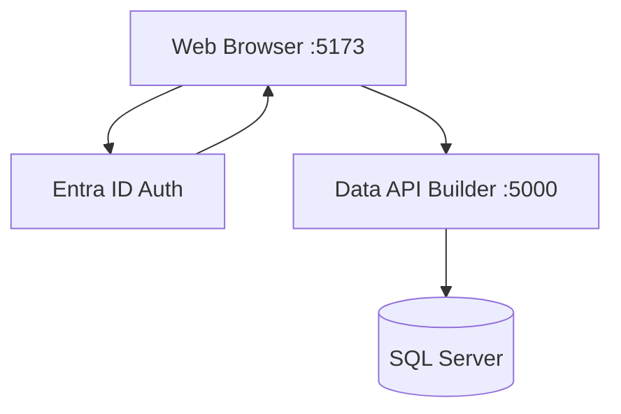
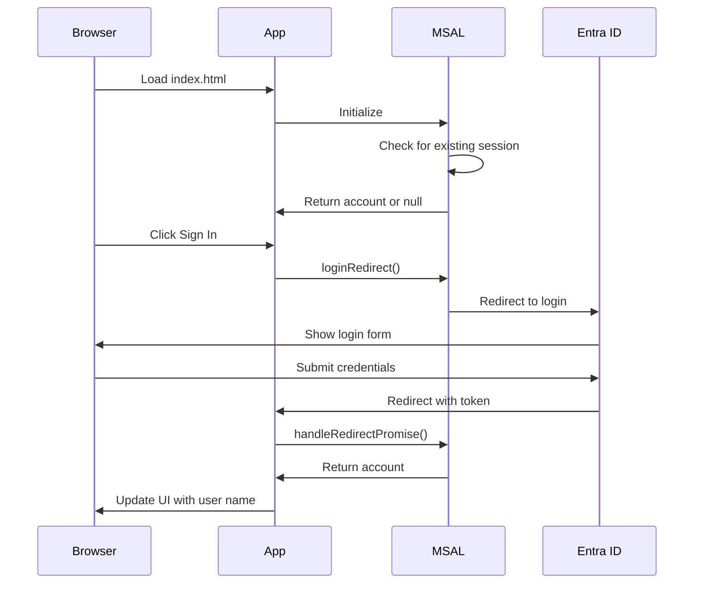

# TODO App with Entra ID Authentication

A minimal TODO application with Microsoft Entra ID (Azure AD) authentication.

## What's Built So Far

- ✅ **Web UI**: HTML/CSS/JavaScript TODO viewer with refresh button
- ✅ **Authentication**: Microsoft Entra ID using MSAL.js
- ✅ **Database**: SQL Server with Todos table and sample data
- ✅ **REST API**: Data API Builder (DAB) with anonymous access
- ✅ **Azure Resources**: Resource group, app registration, test user
- ✅ **Idempotent Setup**: Scripts for Azure and local provisioning

## Architecture



**Key Design:**
- **Two Servers**: Web server on :5173, DAB API on :5000
- **No Build Step**: Plain HTML/CSS/JavaScript (no npm, webpack, Vite)
- **Minimal Dependencies**: Python web server for static files, DAB for API

## Prerequisites

- **Azure CLI** - [Install](https://docs.microsoft.com/cli/azure/install-azure-cli)
- **Azure Subscription** - Active subscription with permissions to create resources
- **SQL Server** - LocalDB, SQL Server Express, or Docker
- **sqlpackage** - Auto-installed by local.ps1 script
- **Data API Builder** - Auto-installed by local.ps1 script
- **Python 3.x** - For local web server (or any HTTP server)
- **PowerShell** - For running setup scripts

## Setup Instructions

### 1. Login to Azure

```powershell
az login
az account set --subscription "your-subscription-name-or-id"
```

### 2. Run Azure Setup Script

The script creates all Azure resources (idempotent - safe to run multiple times):

```powershell
.\azure.ps1
```

**What it creates:**
- Resource Group: `rg-todo-app` (East US)
- App Registration: `todo-app` (configured as SPA)
- Test User: `todo-testuser@yourtenant.onmicrosoft.com`

**Output includes:**
- Client ID (automatically updated in `.env`)
- Tenant ID (automatically updated in `.env`)
- Test user credentials

### 3. Setup Local Development

Start SQL Server (if using Docker):

```powershell
docker run -e 'ACCEPT_EULA=Y' -e 'SA_PASSWORD=YourStrong@Passw0rd' -p 1433:1433 -d mcr.microsoft.com/mssql/server:2022-latest
```

Run local setup script:

```powershell
.\local.ps1
```

**What it does:**
- Checks SQL Server connection
- Deploys database schema with sample data
- Installs Data API Builder CLI
- Creates DAB configuration (anonymous access)
- Adds Todos entity to DAB

### 4. Start Services

**Terminal 1 - Data API Builder:**
```powershell
dab start
```

**Terminal 2 - Web Server:**
```powershell
cd web
python -m http.server 5173
```

### 5. Open the App

Navigate to: http://localhost:5173

## Testing Authentication

1. Click **Sign In** button
2. Browser redirects to Microsoft login
3. Use test credentials:
   - **Username**: `todo-testuser@yourtenant.onmicrosoft.com`
   - **Password**: `TodoTest123!`
4. After successful login, you'll be redirected back to the app
5. Your name appears in the header
6. Click **Sign Out** to log out

## Testing the REST API

1. Click the **↻ Refresh** button to reload todos from the database
2. Open browser DevTools (F12) → Network tab to see API calls
3. Direct API access: http://localhost:5000/api/Todos
4. Swagger UI: http://localhost:5000/swagger (if enabled in DAB config)

**API Response Format (DAB):**
```json
{
  "value": [
    {
      "TodoId": 1,
      "Title": "Review pull requests",
      "DueDate": "2026-02-10",
      "Owner": "sarah.chen@example.com",
      "Completed": false
    }
  ]
}
```

## Project Structure

```
github-copilot2/
├── azure.ps1              # Azure resource provisioning
├── local.ps1              # Local development setup
├── dab-config.json        # Data API Builder configuration
├── .env                   # All configuration (connection strings, Entra ID, API URL)
├── .gitignore             # Protects .env and secrets
├── database/
│   ├── database.sqlproj   # SQL Database project
│   ├── Tables/
│   │   └── Todos.sql      # Todos table schema
│   └── Scripts/
│       └── PostDeployment.sql  # Sample data
├── web/
│   ├── index.html         # Main app (MSAL.js + API integration)
│   └── .gitignore         # Additional web-specific ignores
└── README.md              # This file
```

## Configuration Files

### `.env` (root)
**Single source of truth for all configuration:**
```
# Database (used by DAB)
DATABASE_CONNECTION_STRING=Server=localhost;Database=TodoDb;User Id=sa;Password=YourStrong@Passw0rd;TrustServerCertificate=True

# Entra ID Configuration (for reference - hardcoded in web/index.html)
ENTRA_CLIENT_ID=<your-client-id>
ENTRA_TENANT_ID=<your-tenant-id>
ENTRA_REDIRECT_URI=http://localhost:5173

# API (for reference - hardcoded in web/index.html)
API_URL=http://localhost:5000
```

**Note:** Entra ID and API values are currently hardcoded in `web/index.html` for simplicity. The `.env` file serves as documentation and is used by DAB for database connection.

**To update hardcoded values in `web/index.html`:**
1. After running `azure.ps1`, note the Client ID and Tenant ID
2. Edit `web/index.html` and update the `msalConfig` object:
   ```javascript
   const msalConfig = {
       auth: {
           clientId: 'your-client-id-here',
           authority: 'https://login.microsoftonline.com/your-tenant-id-here',
           redirectUri: 'http://localhost:5173'
       },
       ...
   };
   ```

### `dab-config.json`
Data API Builder configuration with Todos entity and anonymous access.

**⚠️ Important:** `.env` is excluded from git via `.gitignore`

## Azure Resources Created

| Resource Type | Name | Purpose |
|--------------|------|---------|
| Resource Group | `rg-todo-app` | Container for future resources (SQL, etc.) |
| App Registration | `todo-app` | Entra ID SPA authentication |
| Test User | `todo-testuser@...` | For testing authentication |

### App Registration Details

- **Platform**: Single-Page Application (SPA)
- **Redirect URI**: http://localhost:5173
- **Authentication**: Auth code flow with PKCE (MSAL.js SPA)
- **Scopes**: User.Read

## Troubleshooting

### SQL Server Connection Failed

**Error:** "Login failed for user 'sa'"

**Fix:**
1. Make sure SQL Server is running
2. Verify credentials in `.env` file
3. For Docker: Use the password from the docker run command

### DAB API Returns 404

**Error:** "Could not connect to API"

**Fix:**
1. Make sure DAB is running: `dab start`
2. Check DAB is on port 5000: http://localhost:5000/api/Todos
3. Verify `dab-config.json` exists and has Todos entity

### CORS Error in Browser

**Error:** "Access to fetch at 'http://localhost:5000' has been blocked by CORS"

**Fix:**
DAB config should have CORS enabled for http://localhost:5173. Re-run `.\local.ps1` to regenerate config.

### "Cross-origin token redemption" Error

This means the app registration is configured as "Web" instead of "SPA". 

**Fix:**
```powershell
.\azure.ps1  # Script automatically updates to SPA platform
```

### Browser Shows "Not signed in" After Login

1. Open browser DevTools (F12)
2. Go to Console tab
3. Look for error messages
4. Common causes:
   - App registration not configured as SPA
   - Redirect URI mismatch
   - Browser blocking popups/redirects

### Can't Find App Registration in Azure Portal

App registrations are tenant-level resources, not in resource groups.

**To find:**
1. Go to **Microsoft Entra ID** (not Resource Groups)
2. Click **App registrations**
3. Look for **todo-app**

Or run:
```powershell
az ad app list --display-name "todo-app" --query "[].{Name:displayName, ClientId:appId}" -o table
```

## Authentication Flow



## Next Steps (Coming Soon)

1. **Owner-based Filtering** - Filter todos by logged-in user email
2. **Azure Deployment** - Deploy SQL Server and DAB to Azure
3. **Authentication for DAB** - Replace anonymous access with Entra ID token validation
4. **CRUD Operations** - Add create, update, delete functionality

## Security Notes

- **Never commit `.env`** - Contains sensitive IDs (protected by `.gitignore`)
- **Test user password** - Change in production environments
- **Localhost only** - Current setup only works on `http://localhost:5173`
- **Production deployment** - Requires updating redirect URIs in app registration

## Development Commands

```powershell
# Azure setup (idempotent)
.\azure.ps1

# Local setup (deploy database, configure DAB)
.\local.ps1

# Start Data API Builder
dab start

# Start web server
cd web; python -m http.server 5173

# Build database project
dotnet build database/database.sqlproj

# Deploy database manually
sqlpackage /Action:Publish /SourceFile:database/bin/Debug/database.dacpac /TargetConnectionString:"Server=localhost;Database=TodoDb;User Id=sa;Password=YourStrong@Passw0rd;TrustServerCertificate=True"

# Test API directly
curl http://localhost:5000/api/Todos

# View app registration
az ad app show --id <client-id>

# Clean up Azure resources
az group delete --name rg-todo-app --yes --no-wait
```

## License

This is a demonstration project for learning purposes.
