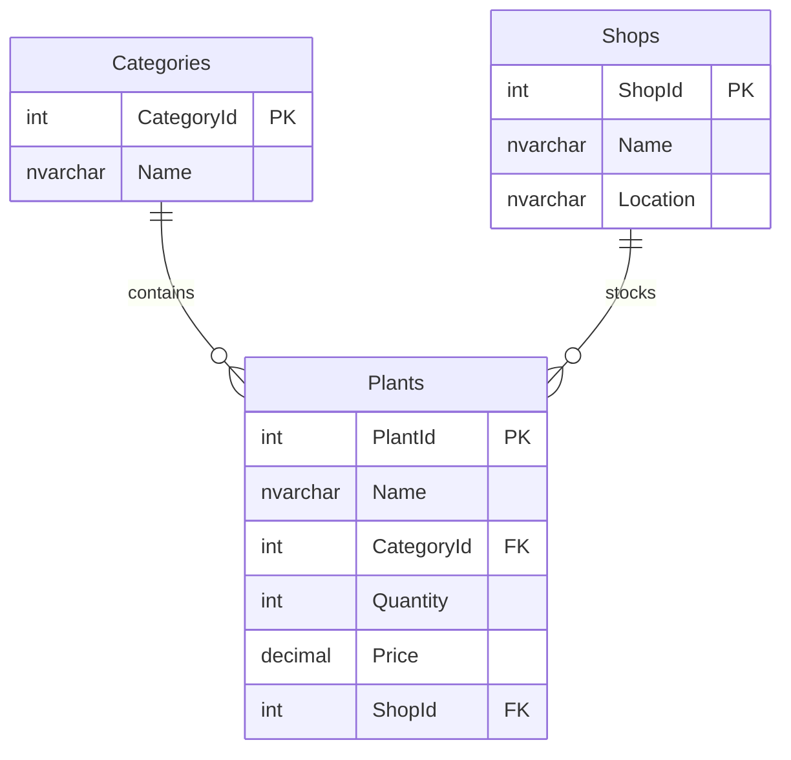

# Flower Shop — Copilot Demo

Built entirely by GitHub Copilot. From schema design to Azure deployment — no hand-written code.

## What Copilot Built

- **SQL Database Project** — 3 tables, seed data, SqlPackage deployment
- **Data API Builder** — REST + MCP endpoints, zero custom code
- **Docker Compose** — SQL Server 2025, DAB, SQL Commander
- **Azure Deployment** — Azure SQL, ACR, Container Apps (custom image pattern)
- **Copilot Skills** — 6 reusable skills for DAB, Docker, Aspire, MCP, CLI, Config

## Use the Skills in Your Own Workspace

Copy the `.github/` folder into any repo to give Copilot deep knowledge of Data API Builder, SQL projects, Docker, Aspire, and MCP. It includes:

- **`copilot-instructions.md`** — Workflow rules that guide Copilot from schema design through Azure deployment
- **6 skills** — Domain-specific instructions Copilot loads automatically when relevant

These files teach Copilot *how you work* so it follows your patterns instead of guessing.

## What a Conversation Looks Like

With the `.github/` folder in your repo, open Copilot Chat and say:

> **You:** Help me track inventory for my flower shop.

Copilot will:

1. Ask clarifying questions about your data
2. Propose a minimal schema and show you an ERD
3. Wait for your approval before touching any files
4. Ask about orchestration (Docker or Aspire)
5. Create the database project, DAB config, and compose files
6. Build, deploy, and open SQL Commander — all from chat

> **You:** Deploy this to Azure.

Copilot will create the Azure SQL database, build a custom Docker image with your DAB config, push it to ACR, and deploy to Container Apps. One prompt, no portal clicking.

> **You:** Set up MCP so you can query my database directly.

Copilot will enable the MCP endpoint in DAB, create `.vscode/mcp.json`, and start reading and writing data on your behalf.

Every step follows the rules in `.github/copilot-instructions.md` — schema first, MVP only, no extras unless you ask.

## Database Schema



## Run Locally

```powershell
.\docker-up.ps1
```

## Deploy to Azure

```powershell
.\azure\azure-up.ps1
```

## Architecture

```
database/          SQL Database Project (schema + seed data)
dab-config.json    Data API Builder config (REST + MCP)
docker-compose.yml Local dev stack
docker-up.ps1      One-command local startup
docker-down.ps1    Stop and remove local services
azure/             Azure deployment (Bicep, scripts, Dockerfile)
.github/           Copilot instructions + 6 skills
```
