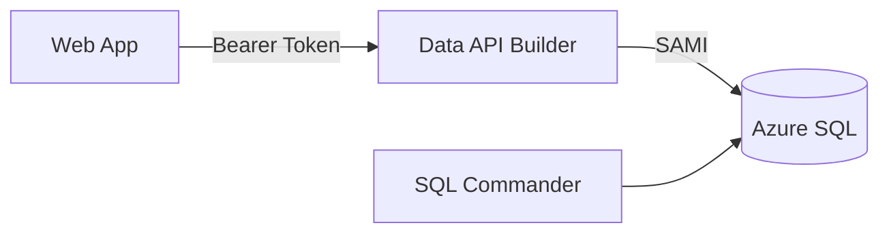
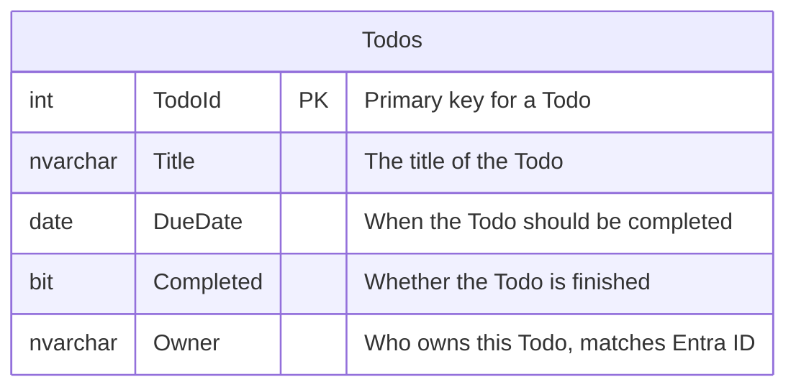
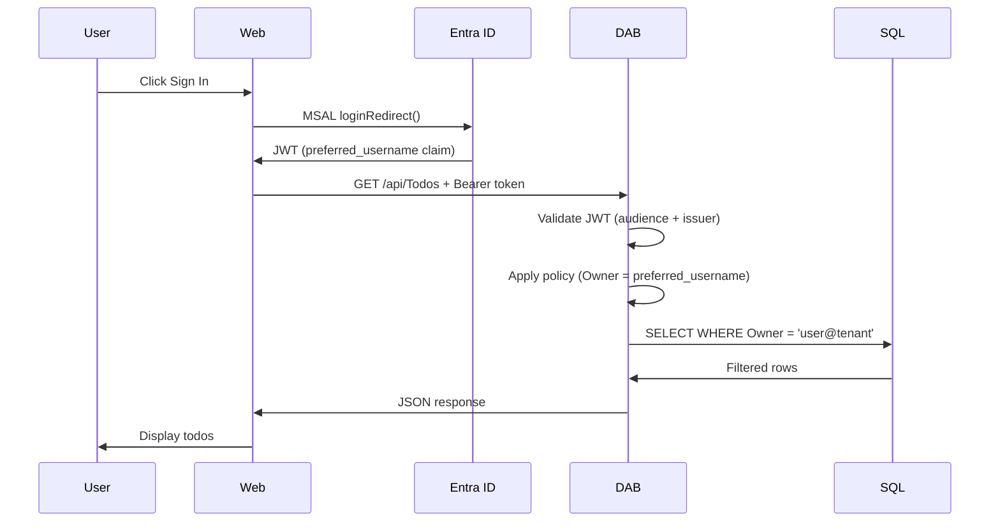

# TODO App with Entra ID Authentication

A minimal TODO application with Microsoft Entra ID authentication, row-level security, and zero custom API code.

## Security Chain

```
User → OAuth → Web → Bearer Token → DAB → SAMI → SQL
```

1. User signs in via MSAL.js (Entra ID)
2. Web app acquires `api://<clientId>/access_as_user` token
3. DAB validates JWT (audience + issuer)
4. DAB applies database policy: `@item.Owner eq @claims.preferred_username`
5. DAB authenticates to SQL via System Assigned Managed Identity
6. SQL returns only that user's rows

> **SQL Commander** uses SQL Auth (admin credentials) for direct database access. It's a dev/admin tool — not user-facing, no Entra ID, no row-level filtering.

## Architecture



## Database Schema



## Prerequisites

### Local Development

- [.NET 10+ SDK](https://dotnet.microsoft.com/download)
- [Aspire CLI](https://learn.microsoft.com/dotnet/aspire/fundamentals/setup-tooling) — local orchestration
- [Azure CLI](https://docs.microsoft.com/cli/azure/install-azure-cli) (for Entra ID app registration)
- [Data API Builder](https://learn.microsoft.com/azure/data-api-builder/) — zero-code API
- [Docker Desktop](https://www.docker.com/products/docker-desktop/)
- [PowerShell](https://learn.microsoft.com/powershell/scripting/install/installing-powershell) (included on Windows)

> Run `dotnet tool restore` to install Aspire CLI and DAB from the included tool manifest.

### Azure Deployment

- [.NET 10+ SDK](https://dotnet.microsoft.com/download)
- [Azure CLI](https://docs.microsoft.com/cli/azure/install-azure-cli)
- [Azure Developer CLI](https://learn.microsoft.com/azure/developer/azure-developer-cli/install-azd)
- [Data API Builder](https://learn.microsoft.com/azure/data-api-builder/) — zero-code API
- [PowerShell](https://learn.microsoft.com/powershell/scripting/install/installing-powershell) (included on Windows)
- [SqlPackage](https://learn.microsoft.com/sql/tools/sqlpackage/sqlpackage) — schema deployment
- Azure subscription with permissions to create resources

> Run `dotnet tool restore` to install DAB and SqlPackage from the included tool manifest.

## Quick Start

### Local Development

```powershell
az login
./infra/setup-local.ps1          # creates Entra ID app reg, test user, updates config.js + dab-config.json
aspire run                       # starts SQL Server, DAB, SQL Commander, MCP Inspector
```

Open http://localhost:5173. Aspire Dashboard at http://localhost:15888.

> `setup-local.ps1` only needs to run once. After that, `aspire run` works on its own.

### Deploy to Azure

```powershell
azd env set AZURE_SQL_ADMIN_PASSWORD "YourStrong@Passw0rd"
azd up                           # provisions + deploys everything
```

### Tear Down

```powershell
azd down                         # deletes Azure resources + app registration + test user
```

## Project Structure

```
├── azure.yaml                    # azd project config (must be at root)
├── .aspire/
│   └── apphost.cs                # Aspire orchestration (local dev only)
├── api/
│   ├── dab-config.json           # DAB configuration file
│   └── Dockerfile                # Custom DAB image for Azure
├── database/
│   ├── database.sqlproj           # SQL Database Project
│   ├── Tables/Todos.sql           # Table schema
│   └── Scripts/PostDeployment.sql # Seed data
├── infra/
│   ├── main.bicep                # Subscription-scope entry point
│   ├── resources.bicep           # All Azure resources
│   ├── main.parameters.json      # azd parameter mappings
│   ├── setup-local.ps1           # Local dev setup (app reg, scopes, test user, dab configure)
│   ├── pre-up.ps1                # azd hook: Entra ID setup before Bicep
│   ├── post-up.ps1               # azd hook: deploy after Bicep (schema, ACR, container, web)
│   └── post-down.ps1             # azd hook: cleanup app registration + test user
├── web/
│   ├── index.html                # SPA shell
│   ├── styles.css                # Stylesheet
│   ├── config.js                 # MSAL + API config (placeholders in repo)
│   └── app.js                    # Auth + API logic (bearer token, MSAL)
└── .vscode/
    └── mcp.json                  # MCP server for Copilot database access
```

## How Scripts Work

### Local setup (`infra/setup-local.ps1`)

One-time setup for local dev. No `azd` needed — uses Azure CLI only:

1. App registration with SPA redirect + `access_as_user` API scope
2. Pre-authorizes SPA (no consent prompt)
3. Runs `dab configure` to write real audience/issuer into `dab-config.json`
4. Writes `config.js` with real clientId/tenantId
5. Creates test user

### Pre-up (`infra/pre-up.ps1`)

`azd` hook — runs before Bicep during `azd up`. Same Entra ID setup as `setup-local.ps1`, plus stores values via `azd env set` for post-up.

### Post-up (`infra/post-up.ps1`)

Runs after Bicep. Only consumes stored values — never creates Entra ID resources:

1. Opens SQL firewall for deployment
2. Deploys database schema (`sqlpackage`)
3. Sets Entra admin, creates SAMI database user
4. Updates seed data with test user UPN
5. Runs `dab configure` to update auth values
6. Builds + pushes DAB image to ACR
7. Updates container app with custom image
8. Adds Azure redirect URI to app registration
9. Generates `config.js` with Azure URLs, deploys web files

## Configuration

Both `config.js` and `dab-config.json` ship with placeholder values (`__CLIENT_ID__`, `__AUDIENCE__`, etc.). The hooks replace these with real values. `apphost.cs` checks for placeholders at startup and fails fast if they haven't been replaced.

All secrets live in `.azure/` (git-ignored). Set via `azd env set`.

## Azure Resources

| Resource | Name Pattern | Purpose |
|----------|-------------|---------|
| Resource Group | `rg-{token}-{env}` | Container |
| Azure SQL Server | `sql-svr-{token}` | Database server |
| Azure SQL Database | `sql-db` | App database |
| Container Registry | `acr{token}` | DAB image |
| Container Apps Env | `aca-cae-{token}` | Container hosting |
| Container App (DAB) | `aca-dab-{token}` | API (SAMI to SQL) |
| Container App (Cmdr) | `aca-cmdr-{token}` | SQL Commander |
| App Service Plan | `web-app-plan-{token}` | B1 Linux |
| Web App | `web-app-{token}` | Static frontend |
| App Registration | `app-{env}` | Entra ID SPA |
| Test User | `testuser-{env}@...` | Testing |

> `{token}` = `uniqueString(subscription, env, location)`

## Testing

Sign in with the test user created by setup:
- **Username**: `testuser-{env}@yourtenant.onmicrosoft.com`
- **Password**: `TodoTest123!`

Only todos where `Owner` matches the signed-in user's UPN are returned.

## Authentication Flow



## License

Demonstration project for learning purposes.
