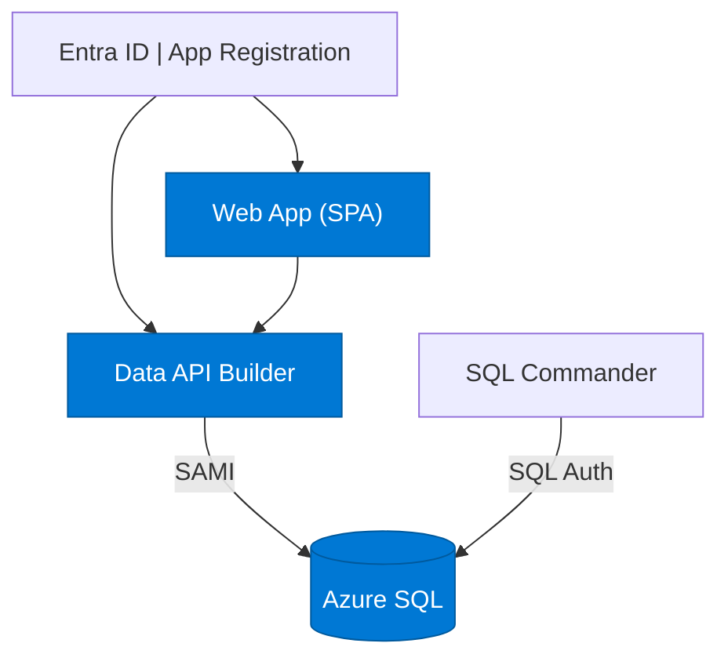
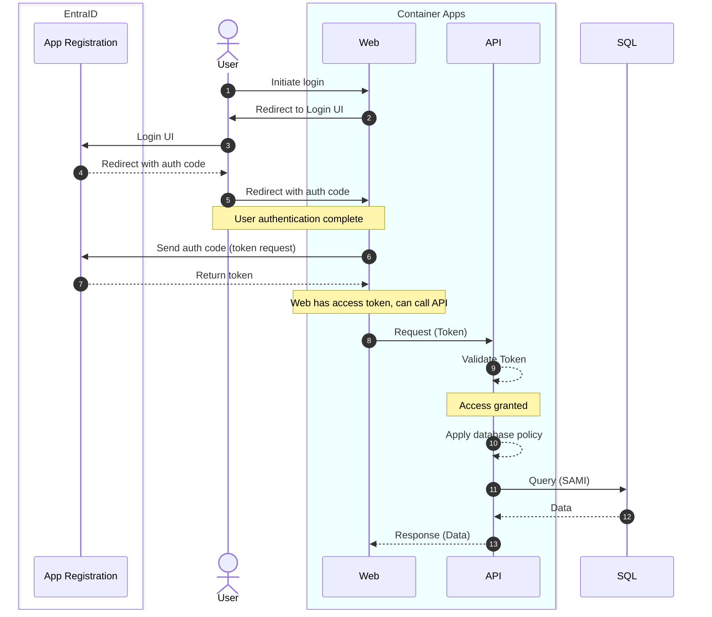
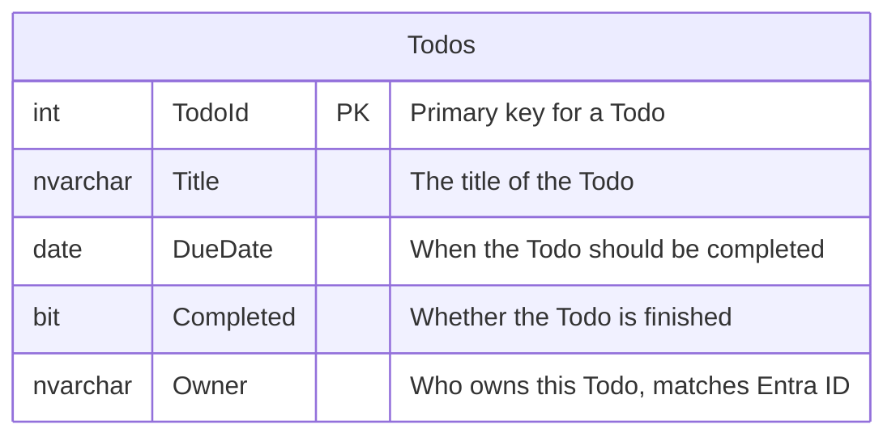

# Simple Todo App with Entra ID Authentication

A minimal todo app with Microsoft Entra ID auth, row-level security, and zero custom API code.

## Overview



 * **Web App**: SPA using Entra ID (OAuth) for auth
 * **Data API Builder**: Zero-code API with Entra ID (OAuth) for auth
 * **SQL Server (local)**: Database with SQL Authentication
 * **Azure SQL (Azure)**: Database with Entra ID (SAMI) for auth

## How does authentication flow?



- **User -> Web** auth is Entra Id (OAuth) via interaction (login UI)
- **Web -> API*** auth is Entra Id (OAuth) via token in header
- **API** applies row-level security policy: `@item.Owner eq @claims.preferred_username`
- **API -> SQL Server (local)** auth is via SQL Authentication
- **API -> Azure SQL (Azure)** auth is via System Assigned Managed Identity (SAMI)

## Database Schema

This demo has just one table, `Todos`. Each todo is owned by a user, and the API only returns todos where the `Owner` column matches the signed-in user's UPN (for example: test-user@domain.com) which is enforced via DAB permissions policy.



## Prepare for the Demo

### Local Prerequisites

- [.NET 10+ SDK](https://dotnet.microsoft.com/download)
- [Aspire workload](https://learn.microsoft.com/dotnet/aspire/fundamentals/setup-tooling) — run `dotnet workload install aspire`
- [Azure CLI](https://docs.microsoft.com/cli/azure/install-azure-cli) (for Entra ID app registration)
- [Data API Builder](https://learn.microsoft.com/azure/data-api-builder/) — zero-code API
- [Docker Desktop](https://www.docker.com/products/docker-desktop/)
- [PowerShell](https://learn.microsoft.com/powershell/scripting/install/installing-powershell) (included on Windows)

> Run `dotnet tool restore` to install DAB from the included tool manifest.

**Azure Permissions Required:**
- Create app registrations and users in Entra ID
- Set SQL Server Active Directory admin
- Install PowerShell modules (SqlServer module for schema deployment)

### Azure Prerequisites

- [.NET 10+ SDK](https://dotnet.microsoft.com/download)
- [Azure CLI](https://docs.microsoft.com/cli/azure/install-azure-cli)
- [Azure Developer CLI](https://learn.microsoft.com/azure/developer/azure-developer-cli/install-azd)
- [Data API Builder](https://learn.microsoft.com/azure/data-api-builder/) — zero-code API
- [PowerShell](https://learn.microsoft.com/powershell/scripting/install/installing-powershell) (included on Windows)
- Azure subscription with permissions to create resources

> Run `dotnet tool restore` to install DAB from the included tool manifest.

**Azure Permissions Required:**
- Create app registrations and users in Entra ID
- Create Azure resources (SQL, Container Apps, ACR, Web Apps)
- Set SQL Server Active Directory admin
- Install PowerShell modules (SqlServer module for schema deployment)

### Set up Microsoft Entra (local + Azure)

Creates the app registration, scope, test user, and writes auth values into config files.

```powershell
az login
./azure/entra-setup.ps1
```

### Tear down Microsoft Entra (local assets)

```powershell
az login
./azure/post-down.ps1
```

## Quick Start A (Local)

```powershell
az login
./azure/entra-setup.ps1          # creates Entra ID app reg, test user, updates config.js + dab-config.json
dotnet run --project apphost     # starts SQL Server, DAB, SQL Commander (SQL Auth locally)
```

> Note: `entra-setup.ps1` is only required the FIRST time you run (same with az login).

## Quick Start B (Azure)

```powershell
azd env set AZURE_SQL_ADMIN_PASSWORD "YourStrong@Passw0rd"
azd up                           # provisions + deploys everything
```

### Tear Down Azure Resources (when you are done)

```powershell
azd down                         # deletes Azure resources + app registration + test user
```

## Project Structure

```
├── api/
│   ├── dab-config.json           # DAB configuration file
│   └── Dockerfile                # Custom DAB image for Azure
├── apphost/
│   ├── apphost.csproj            # Aspire AppHost project
│   └── Program.cs                # Aspire orchestration (local dev only)
├── azure/
│   ├── entra-setup.ps1           # Entra ID setup (app reg, scopes, test user, dab configure)
│   ├── entra-teardown.ps1        # azd hook: cleanup app registration + test user
│   ├── main.bicep                # Subscription-scope entry point
│   ├── main.parameters.json      # azd parameter mappings
│   ├── main.after.ps1            # azd hook: deploy after Bicep (schema, ACR, container, web)
│   └── resources.bicep           # All Azure resources
├── azure.yaml                    # azd project config (must be at root)
├── database.sql                  # Database schema (tables + seed data)
├── web/
│   ├── app.js                    # UI layer (rendering, events, escapeHtml)
│   ├── auth.js                   # MSAL auth (login, logout, token)
│   ├── config.js                 # Unique config (placeholders in repo)
│   ├── dab.js                    # DAB data layer (fetch, create, toggle, delete)
│   ├── index.html                # SPA shell
│   └── styles.css                # Stylesheet
```

## How Scripts Work

### Entra ID setup (`azure/entra-setup.ps1`)

One script for both local and cloud. Run directly for local dev; `azd up` calls it via the `preprovision` hook in `azure.yaml`. Auto-detects context from `AZURE_ENV_NAME` env var (set by azd; absent = local).

1. App registration with SPA redirect + `access_as_user` API scope
2. Pre-authorizes SPA (no consent prompt)
3. Runs `dab configure` to write real audience/issuer into `dab-config.json`
4. Writes `config.js` with real clientId/tenantId
5. Creates test user and assigns `sample-role-1`

### Post-provision (`azure/main.after.ps1`)

Runs after Bicep. Only consumes stored values — never creates Entra ID resources:

1. Opens SQL firewall for deployment
2. Deploys database schema (`database.sql` via `Invoke-Sqlcmd`)
3. Sets Entra admin, creates SAMI database user
4. Assigns seed data to test user
5. Runs `dab configure` to set audience/issuer for Azure
6. Builds + pushes DAB image to ACR
7. Updates container app with custom image
8. Adds Azure redirect URI to app registration
9. Generates `config.js` with Azure URLs, deploys web files

## Configuration

- `config.js` and `dab-config.json` are written with real client/tenant/audience values by `entra-setup.ps1`; only `apiUrlAzure` remains a placeholder until Azure deploy.
- AppHost fails fast only if `__CLIENT_ID__` or `__AUDIENCE__` remain; it does not block on the `apiUrlAzure` placeholder.
- CORS in `dab-config.json` includes `http://localhost:5173` and the baked-in Azure web host; update the host if you change the web app name.
- All secrets live in `.azure/` (git-ignored). Set via `azd env set`.

## Azure Resources

| Resource | Name Pattern | Purpose |
|----------|-------------|---------|
| Resource Group | `rg-{token}-{env}` | Container |
| Azure SQL Server | `sql-svr-{token}` | Database server |
| Azure SQL Database | `sql-db` | App database |
| Container Registry | `acr{token}` | DAB image |
| Container Apps Env | `aca-cae-{token}` | Container hosting |
| Container App (DAB) | `aca-dab-{token}` | API (SAMI to SQL) |
| Container App (Cmdr) | `aca-cmdr-{token}` | SQL Commander |
| App Service Plan | `web-app-plan-{token}` | B1 Linux |
| Web App | `web-app-{token}` | Static frontend |
| App Registration | `app-{env}` | Entra ID SPA |
| Test User | `testuser-{env}@...` | Testing |

> `{token}` = `uniqueString(subscription, env, location)`

## Testing

Sign in with the test user created by setup:
- **Username**: `testuser-{env}@yourtenant.onmicrosoft.com`
- **Password**: `TodoTest123!`

Only todos where `Owner` matches the signed-in user's UPN are returned.

## License

Demonstration project for learning purposes.
