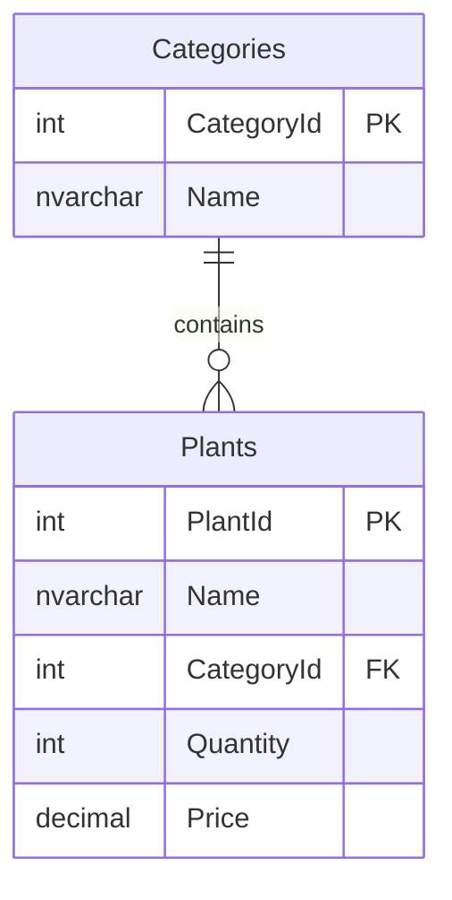

# Database Schema Overview

## Flower Shop Plant Inventory

This database tracks plant inventory for a flower shop.

## Entity Relationship Diagram

## Tables

### Categories
- **CategoryId** (Primary Key): Unique identifier for each category
- **Name**: Name of the category (e.g., Succulents, Tropical Plants)

### Plants
- **PlantId** (Primary Key): Unique identifier for each plant
- **Name**: Name of the plant
- **CategoryId** (Foreign Key): Links to Categories table
- **Quantity**: Number of units in stock
- **Price**: Price per unit
