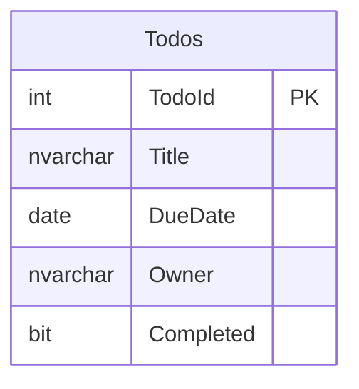

# Database Overview

## TODO Application Database Schema

This database stores tasks with ownership tracking for multi-user support.

## Entity Relationship Diagram

## Tables

### Todos
Stores individual TODO items with owner tracking.

| Column | Type | Constraints | Description |
|--------|------|-------------|-------------|
| TodoId | int | PRIMARY KEY, IDENTITY(1,1) | Unique identifier |
| Title | nvarchar(200) | NOT NULL | Task description |
| DueDate | date | NOT NULL | Target completion date |
| Owner | nvarchar(100) | NOT NULL | User email (from Entra ID token) |
| Completed | bit | NOT NULL, DEFAULT 0 | Completion status |

## Sample Data

Initial seed data includes 7 sample tasks across 4 different owners for testing multi-user scenarios.

## Security Model

- **Owner-based filtering**: Each user sees only their tasks (filtered by Owner = logged-in email)
- **Future**: Row-level security can be added in SQL Server for additional protection
