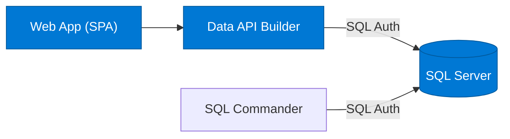
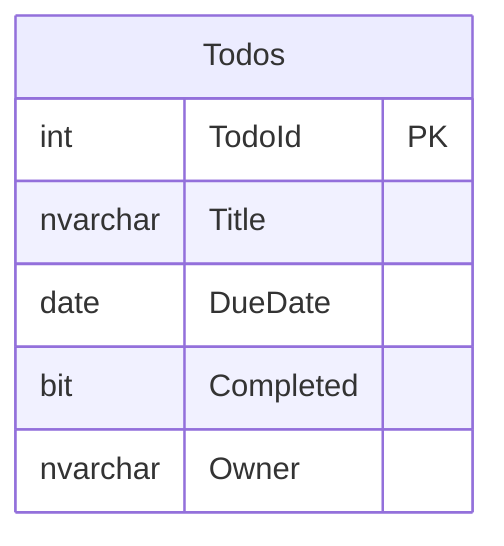

# Quickstart 1: Zero Auth

A minimal todo app with **no authentication** — the simplest way to get started with Data API Builder.

## What You'll Learn

- Set up DAB with anonymous access
- Use .NET Aspire to orchestrate SQL Server + DAB locally
- Deploy to Azure with `azd up`

## Auth Matrix

| Hop | Auth |
|-----|------|
| User → Web | None |
| Web → API | None |
| API → SQL (local) | SQL Auth |
| API → SQL (Azure) | SQL Auth |

## Architecture



## Prerequisites

- [.NET 10+ SDK](https://dotnet.microsoft.com/download)
- [Aspire workload](https://learn.microsoft.com/dotnet/aspire/fundamentals/setup-tooling) — `dotnet workload install aspire`
- [Docker Desktop](https://www.docker.com/products/docker-desktop/)

> Run `dotnet tool restore` to install DAB from the included tool manifest.

## Run Locally

```bash
dotnet tool restore
aspire run
```

Aspire dashboard opens at `http://localhost:15888`. The web app is at `http://localhost:5173`.

## Deploy to Azure

```bash
azd auth login
azd up
```

This provisions Azure SQL, Container Apps (DAB + SQL Commander), and App Service (web).

## Database Schema



## Next Steps

- [Quickstart 2](../quickstart2/) — Add managed identity (SAMI) for DAB → Azure SQL
- [Quickstart 3](../quickstart3/) — Add Entra ID authentication for users
- [Quickstart 4](../quickstart4/) — Add row-level security with DAB policies
