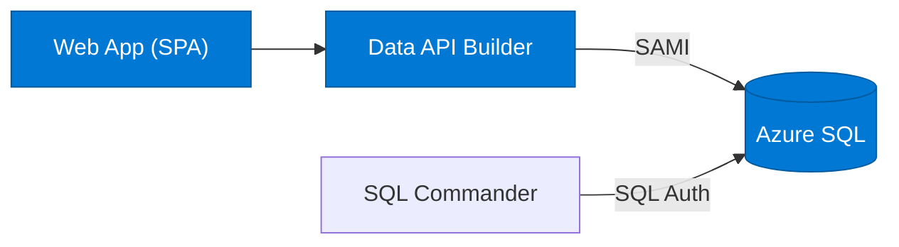

# Quickstart 2: Managed Identity

Builds on [Quickstart 1](../quickstart1/) by replacing SQL Auth with **System Assigned Managed Identity (SAMI)** for DAB → Azure SQL. Locally, everything stays the same.

## What You'll Learn

- Configure DAB with SAMI for passwordless Azure SQL access
- Set Entra admin on Azure SQL
- Create a database user from an external provider

## Auth Matrix

| Hop | Local | Azure |
|-----|-------|-------|
| User → Web | None | None |
| Web → API | None | None |
| API → SQL | SQL Auth | **SAMI** |

## Architecture



## Prerequisites

- [.NET 10+ SDK](https://dotnet.microsoft.com/download)
- [Aspire workload](https://learn.microsoft.com/dotnet/aspire/fundamentals/setup-tooling) — `dotnet workload install aspire`
- [Docker Desktop](https://www.docker.com/products/docker-desktop/)

> Run `dotnet tool restore` to install DAB from the included tool manifest.

## Run Locally

```bash
dotnet tool restore
aspire run
```

Locally, DAB uses SQL Auth to talk to the containerized SQL Server — same as Quickstart 1.

## Deploy to Azure

```bash
azd auth login
azd up
```

The post-provision script automatically:
1. Sets you as Entra admin on Azure SQL
2. Creates a database user for DAB's managed identity (`CREATE USER [name] FROM EXTERNAL PROVIDER`)
3. Grants `db_datareader` and `db_datawriter` roles

No passwords stored for DAB → Azure SQL.

## What Changed from Quickstart 1

| File | Change |
|------|--------|
| `azure/resources.bicep` | DAB container gets `identity: { type: 'SystemAssigned' }` and uses MI connection string |
| `azure/main.bicep` | Outputs `AZURE_CONTAINER_APP_API_PRINCIPAL_ID` |
| `azure/post-provision.ps1` | Adds Entra admin + SAMI user creation steps |

## Next Steps

- [Quickstart 3](../quickstart3/) — Add Entra ID authentication for users
- [Quickstart 4](../quickstart4/) — Add row-level security with DAB policies
