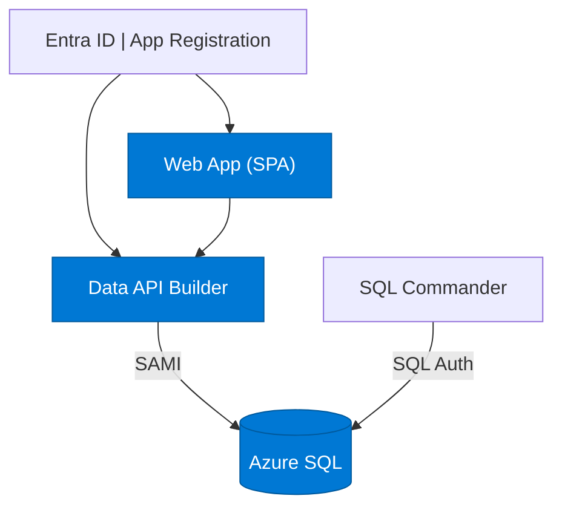

# Quickstart 3: User Authentication

Builds on [Quickstart 2](../quickstart2/) by adding **Entra ID authentication** for users. The web app auto-redirects to Microsoft login — no login button needed.

## What You'll Learn

- Register an app in Entra ID for OAuth
- Configure DAB to validate Entra ID tokens
- Use MSAL in a SPA with auto-redirect (no manual login)
- Pass bearer tokens from web → API

## Auth Matrix

| Hop | Local | Azure |
|-----|-------|-------|
| User → Web | Entra ID (auto-redirect) | Entra ID (auto-redirect) |
| Web → API | Bearer token | Bearer token |
| API → SQL | SQL Auth | **SAMI** |

## Architecture



## Prerequisites

- [.NET 10+ SDK](https://dotnet.microsoft.com/download)
- [Aspire workload](https://learn.microsoft.com/dotnet/aspire/fundamentals/setup-tooling) — `dotnet workload install aspire`
- [Azure CLI](https://docs.microsoft.com/cli/azure/install-azure-cli) (for Entra ID setup)
- [Data API Builder CLI](https://learn.microsoft.com/azure/data-api-builder/) — `dotnet tool restore`
- [Docker Desktop](https://www.docker.com/products/docker-desktop/)
- [PowerShell](https://learn.microsoft.com/powershell/scripting/install/installing-powershell)

**Azure Permissions Required:** Create app registrations in Entra ID.

## Run Locally

```bash
dotnet tool restore
az login
aspire run
```

On first run, Aspire detects that Entra ID isn't configured and offers to run `azure/entra-setup.ps1` interactively. This creates the app registration, updates `config.js` and `dab-config.json`, then starts normally.

The web app auto-redirects to Microsoft login. Once signed in, all API calls include bearer tokens.

## Deploy to Azure

```bash
azd auth login
azd up
```

The `preprovision` hook runs `entra-setup.ps1` automatically. After teardown, `azd down` runs `entra-teardown.ps1` to delete the app registration.

## What Changed from Quickstart 2

| File | Change |
|------|--------|
| `api/dab-config.json` | `authenticated` role + Entra ID auth provider (no policies) |
| `web/auth.js` | MSAL with auto-redirect — calls `handleLogin()` if no session |
| `web/index.html` | Loads MSAL CDN, no login button, shows "Signing in…" |
| `web/dab.js` | Sends bearer token with every API call |
| `web/config.js` | Adds `clientId` and `tenantId` placeholders |
| `apphost/Demo.cs` | Checks for Entra placeholders, guides setup |
| `azure/entra-setup.ps1` | Creates app registration + scope (no test user) |
| `azure/entra-teardown.ps1` | Deletes app registration on `azd down` |

## Next Steps

- [Quickstart 4](../quickstart4/) — Add row-level security with DAB policies
