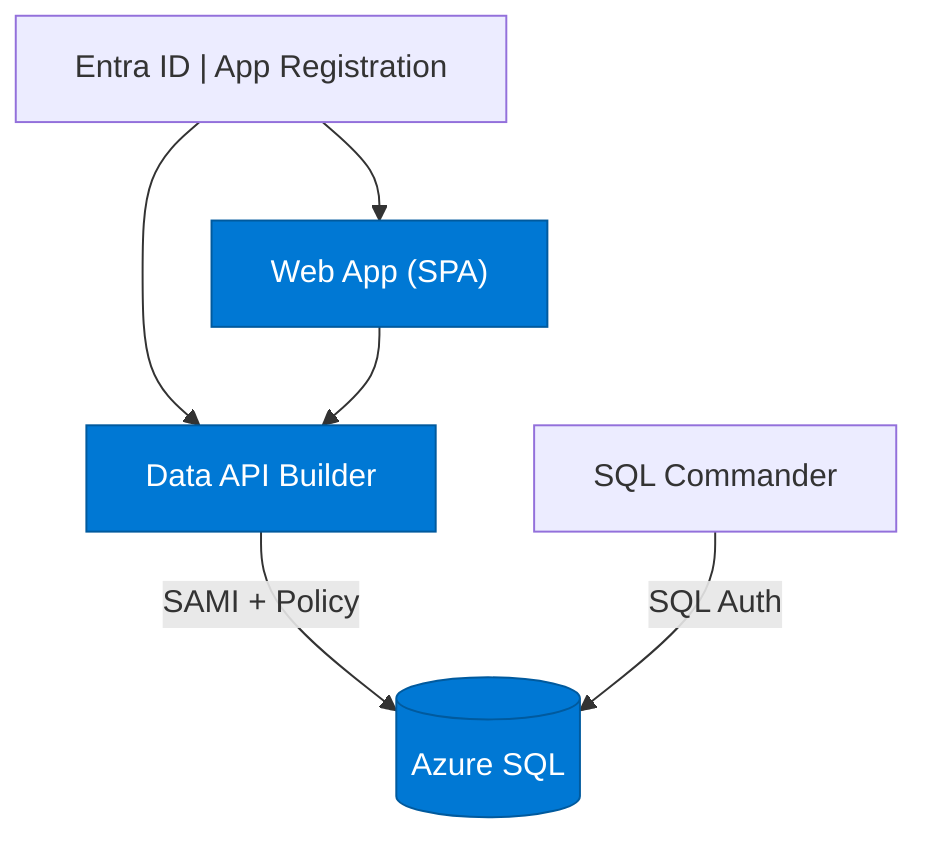
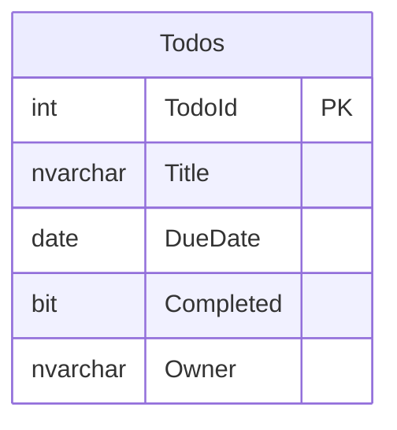

# Quickstart 4: Row-Level Security

Builds on [Quickstart 3](../quickstart3/) by adding **row-level security** via DAB database policies. Each user only sees their own todos.

## What You'll Learn

- Apply DAB database policies (`@item.Owner eq @claims.preferred_username`)
- Use app roles in Entra ID
- Create a test user for demo purposes
- Enforce per-user data isolation with zero custom API code

## Auth Matrix

| Hop | Local | Azure |
|-----|-------|-------|
| User → Web | Entra ID (login button) | Entra ID (login button) |
| Web → API | Bearer token | Bearer token |
| API → SQL | SQL Auth + **policy** | SAMI + **policy** |

## Architecture



## Prerequisites

- [.NET 10+ SDK](https://dotnet.microsoft.com/download)
- [Aspire workload](https://learn.microsoft.com/dotnet/aspire/fundamentals/setup-tooling) — `dotnet workload install aspire`
- [Azure CLI](https://docs.microsoft.com/cli/azure/install-azure-cli) (for Entra ID setup)
- [Data API Builder CLI](https://learn.microsoft.com/azure/data-api-builder/) — `dotnet tool restore`
- [Docker Desktop](https://www.docker.com/products/docker-desktop/)
- [PowerShell](https://learn.microsoft.com/powershell/scripting/install/installing-powershell)

**Azure Permissions Required:** Create app registrations and users in Entra ID.

## Run Locally

```bash
dotnet tool restore
az login
aspire run
```

On first run, Aspire detects Entra ID isn't configured and walks you through setup. The script creates an app registration, a test user (`testuser-{token}@yourdomain.com` / `TodoTest123!`), and an app role assignment.

## Deploy to Azure

```bash
azd auth login
azd up
```

The post-provision script also assigns seed data to the test user so you can log in and see todos immediately.

## The Policy

DAB applies this policy on every read, update, and delete:

```
@item.Owner eq @claims.preferred_username
```

This means the signed-in user can only access rows where `Owner` matches their Entra ID UPN. No custom API code required.

## What Changed from Quickstart 3

| File | Change |
|------|--------|
| `api/dab-config.json` | Adds `policy` to read/update/delete actions |
| `web/index.html` | Login button (manual sign-in instead of auto-redirect) |
| `web/auth.js` | No auto-redirect — user clicks "Sign In" |
| `web/app.js` | Login/logout button toggle in `updateUI()` |
| `azure/entra-setup.ps1` | Creates test user + app role assignment |
| `azure/entra-teardown.ps1` | Deletes test user on `azd down` |
| `azure/post-provision.ps1` | Assigns seed data to test user |

## Database Schema



> The `Owner` column stores the Entra ID UPN. DAB's policy filters rows automatically.
