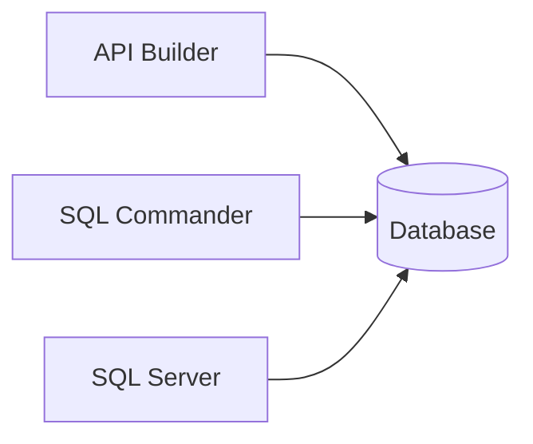
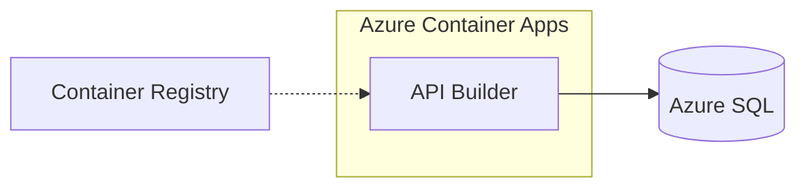

# Flower Shop — Service Overview

## Local (Docker Compose)

| Service | URL |
|---------|-----|
| REST API | [Open Swagger UI](command:simpleBrowser.show?%5B%22http%3A%2F%2Flocalhost%3A5000%2Fswagger%22%5D) |
| SQL Commander | [Open SQL Commander](command:simpleBrowser.show?%5B%22http%3A%2F%2Flocalhost%3A8080%22%5D) |
| SQL Server | `localhost:14330` |

## Azure

| Service | URL |
|---------|-----|
| REST API | [Open Azure API](command:simpleBrowser.show?%5B%22https%3A%2F%2Fflower-shop-api.bluewave-40c6a267.westus.azurecontainerapps.io%2Fapi%2FPlant%22%5D) |
| MCP Endpoint | `https://flower-shop-api.bluewave-40c6a267.westus.azurecontainerapps.io/mcp` |
| Azure Portal | [Open Portal](command:simpleBrowser.show?%5B%22https%3A%2F%2Fportal.azure.com%22%5D) |
